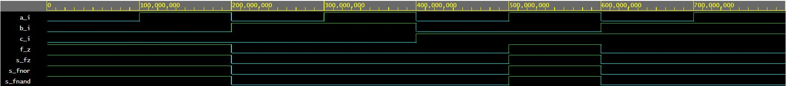

# Lab 01 - Gates

My depository:
[Link](https://github.com/xhroch01/Digital-electronics-1)

## My EDA Playground - De Morgan laws:
[Link to EDA](https://www.edaplayground.com/x/aMPV)


```------------------------------------------------------------------------
--
-- Example of basic OR, AND, XOR gates.
-- Nexys A7-50T, Vivado v2020.1, EDA Playground
--
-- Copyright (c) 2019-2020 Tomas Fryza
-- Dept. of Radio Electronics, Brno University of Technology, Czechia
-- This work is licensed under the terms of the MIT license.
--
------------------------------------------------------------------------

library ieee;               -- Standard library
use ieee.std_logic_1164.all;-- Package for data types and logic operations

------------------------------------------------------------------------
-- Entity declaration for basic gates
------------------------------------------------------------------------
entity gates is
    port(
        a_i    : in  std_logic;         -- Data in
        b_i    : in  std_logic;         -- Data in
        c_i	   : in  std_logic;         -- Data in        
        
        fand_o : out std_logic;         -- AND out function
        for_o  : out std_logic;         -- OR out function
        fxor_o : out std_logic;         -- XOR out function

        fnand_o : out std_logic;        -- NAND out function
        fnor_o  : out std_logic;        -- NOR out function
        f_z     : out std_logic;
        
        mg1_o : out std_logic;
        mg2_o : out std_logic;
        mg3_o : out std_logic;
        mg4_o : out std_logic
        
    );
end entity gates;

------------------------------------------------------------------------
-- Architecture body for basic gates
------------------------------------------------------------------------
architecture dataflow of gates is
begin
    fnand_o <= not((not ((not b_i) and a_i)) and not((not c_i) and(not b_i)));
    
    fnor_o <= (not(b_i or (not a_i))) or (not (c_i or b_i));
    
    f_z <= ((not b_i) and a_i) or ((not c_i) and (not b_i));
    
    mg1_o	<= a_i and not(a_i);		--x * (-x) 	= 0
    
    mg2_o	<= a_i or not(a_i);			--x + (-x) 	= 1
    
    mg3_o	<= a_i or a_i or a_i;		--x + x + x = x
    
    mg4_o	<= a_i and a_i and a_i;		--x * x * x = x
 
end architecture dataflow;
```
## My EDA Playground - Distributive laws:
[Link to EDA](https://www.edaplayground.com/x/i9sa)
