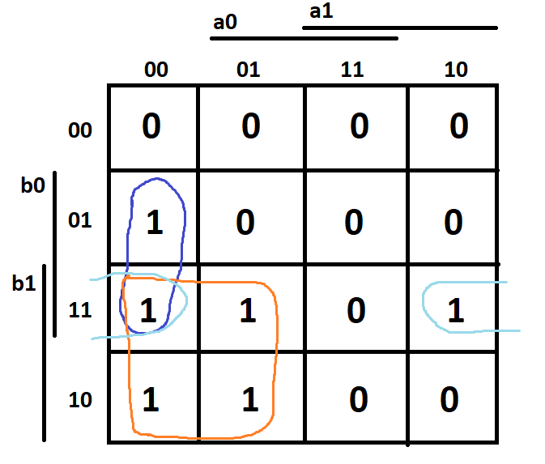
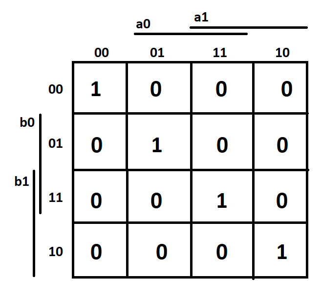
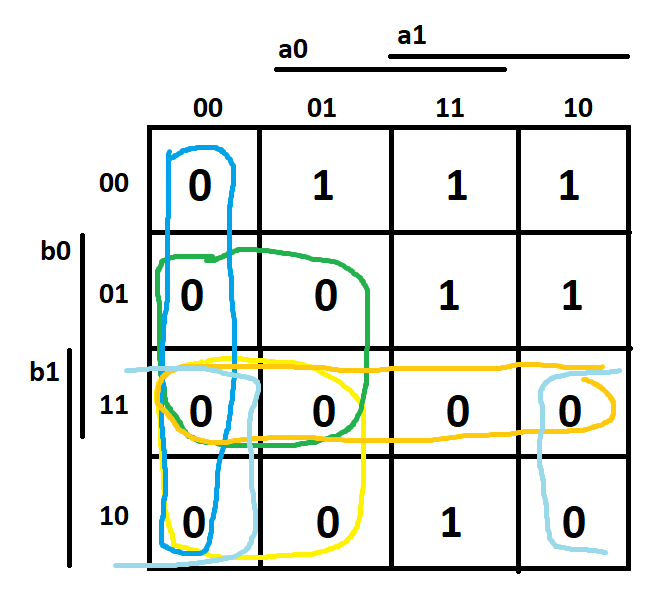

# Pravdivostni tabulka

| **Dec. equivalent** | **B[1:0]** | **A[1:0]** | **B > A** | **B = A** | **B < A** |
| :-: | :-: | :-: | :-: | :-: | :-: |
| **n** | **b** | **a** | 
| 0 | 0 0 | 0 0 | 0 | 1 | 0 |
| 1 | 0 0 | 0 1 | 0 | 0 | 1 |
| 2 | 0 0 | 1 0 | 0 | 0 | 1 |
| 3 | 0 0 | 1 1 | 0 | 0 | 1 |
| 4 | 0 1 | 0 0 | 1 | 0 | 0 |
| 5 | 0 1 | 0 1 | 0 | 1 | 0 |
| 6 | 0 1 | 1 0 | 0 | 0 | 1 |
| 7 | 0 1 | 1 1 | 0 | 0 | 1 |
| 8 | 1 0 | 0 0 | 1 | 0 | 0 |
| 9 | 1 0 | 0 1 | 1 | 0 | 0 |
| 10 | 1 0 | 1 0 | 0 | 1 | 0 |
| 11 | 1 0 | 1 1 | 0 | 0 | 1 |
| 12 | 1 1 | 0 0 | 1 | 0 | 0 |
| 13 | 1 1 | 0 1 | 1 | 0 | 0 |
| 14 | 1 1 | 1 0 | 1 | 0 | 0 |
| 15 | 1 1 | 1 1 | 0 | 1 | 0 |

## B greather A 
(/b1 * b0 * /a1 * /a0) + (b1 * /b0 * /a1 * /a0) + (b1 * /b0 * /a1 * a0) + (b1 * b0 * /a1 * /a0) + (b1 * b0 * /a1 * a0) + (b1 * b0 * a1 * /a0)

## B equals A 
(/b1 * /b0 * /a1 * /a0) + (/b1 * b0 * /a1 * a0) + (b1 * /b0 * a1 * /a0) + (b1 * b0 * a1 * a0)

## B less A 
(b1 + b0 + a1 + a0) * (b1 + /b0 + a1 + a0) * (b1 + /b0 + a1 + /a0) * (/b1 + b0 + a1 + a0) * (/b1 + b0 + a1 + /a0) * (/b1 + b0 + /a1 + a0) * (/b1 + /b0 + a1 + a0) * (/b1 + /b0 + a1 + /a0) * (/b1 + /b0 + /a1 + a0) * (/b1 + /b0 + /a1 + /a0)

# Karnaphova mapa

## B>A

**B > A** = b1 * /a1 + b1 * b0 * /a0 + b0 * /a1 * /a0

## B=A

**B = A** = (/b1 * /b0 * /a1 * /a0) + (/b1 * b0 * /a1 * a0) + (b1 * /b0 * a1 * /a0) + (b1 * b0 * a1 * a0)

## B<A

**B < A** = (/b1 + a1) * (/b0 + a1) * (a0 + a1) * (/b0 + /b1) * (/b1 + a0)

