## VHDL Architecture

```vhdl
architecture Behavioral of amux_2bit_4to1 is
begin
    f_o <= a_i when (sel_i = "00") else
           b_i when (sel_i = "01") else
           c_i when (sel_i = "10") else
           d_i;

end architecture Behavioral;
```

## VHDL Testbench
```vhdl

library ieee;
use ieee.std_logic_1164.all;

------------------------------------------------------------------------
-- Entity declaration for testbench
------------------------------------------------------------------------
entity tb_amux_2bit_4to1 is
    -- Entity of testbench is always empty
end entity tb_amux_2bit_4to1;

------------------------------------------------------------------------
-- Architecture body for testbench
------------------------------------------------------------------------
architecture testbench of tb_amux_2bit_4to1 is

    -- Local signals
    signal s_a       : std_logic_vector(2 - 1 downto 0);
    signal s_b       : std_logic_vector(2 - 1 downto 0);
    signal s_c       : std_logic_vector(2 - 1 downto 0);
    signal s_d       : std_logic_vector(2 - 1 downto 0);
    signal s_sel     : std_logic_vector(2 - 1 downto 0);
    
    signal s_f       : std_logic_vector(2 - 1 downto 0);

begin
    -- Connecting testbench signals with ctb_amux_2bit_4to1 entity (Unit Under Test)
    uut_amux_2bit_4to1 : entity work.amux_2bit_4to1
        port map(
           a_i      => s_a,
           b_i      => s_b,
           c_i      => s_c,
           d_i      => s_d,
           sel_i    => s_sel,
            
           f_o      => s_f
        );

    --------------------------------------------------------------------
    -- Data generation process
    --------------------------------------------------------------------
    p_stimulus : process
    begin
        -- Report a note at the beginning of stimulus process
        report "Stimulus process started" severity note;

        -- First test values
        s_d <= "00"; s_c <= "00"; s_b <= "00"; s_a <= "00";
        s_sel <= "00"; wait for 10 ns;
        
        s_d <= "10"; s_c <= "01"; s_b <= "01"; s_a <= "00";
        s_sel <= "00"; wait for 10 ns;
        
        s_d <= "10"; s_c <= "01"; s_b <= "01"; s_a <= "11";
        s_sel <= "00"; wait for 10 ns;
        
        s_d <= "10"; s_c <= "01"; s_b <= "01"; s_a <= "00";
        s_sel <= "01"; wait for 10 ns;
        
        s_d <= "10"; s_c <= "01"; s_b <= "11"; s_a <= "00";
        s_sel <= "01"; wait for 10 ns;
        
        --s_d <= "10"; s_c <= "01"; s_b <= "11"; s_a <= "00";
        s_sel <= "10"; wait for 10 ns;
        
        --s_d <= "10"; s_c <= "01"; s_b <= "11"; s_a <= "00";
        s_sel <= "11"; wait for 10 ns;
        -- Report a note at the end of stimulus process
        report "Stimulus process finished" severity note;
        wait;
    end process p_stimulus;

end architecture testbench;
```
## Waveform
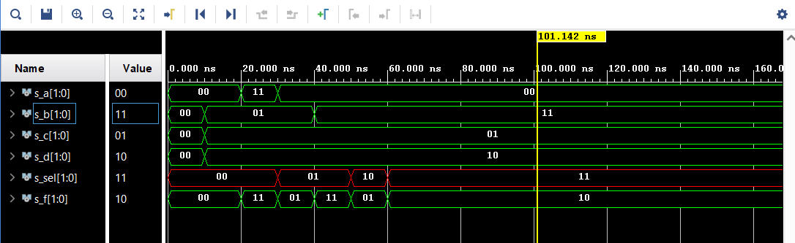

## Schema
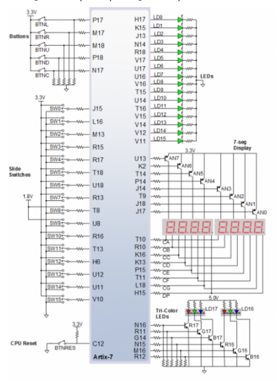

## Tutorial
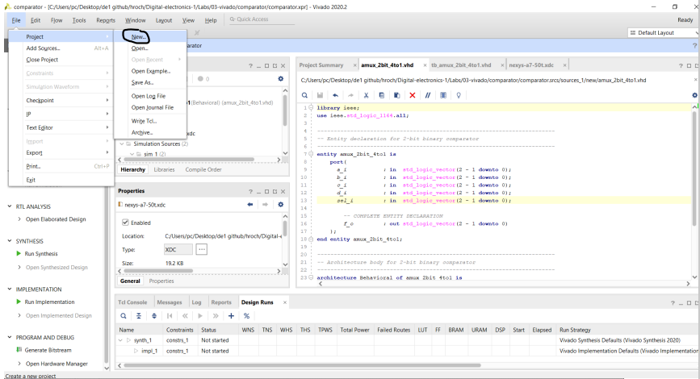

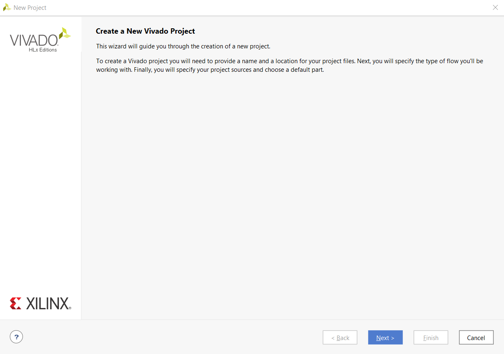

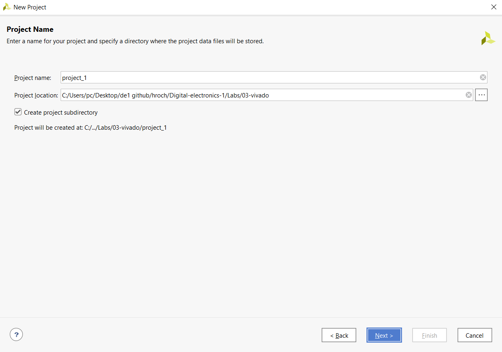

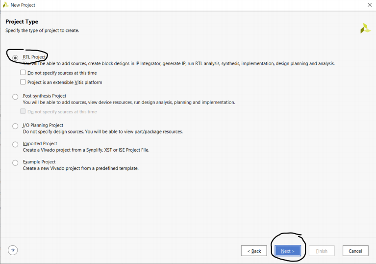

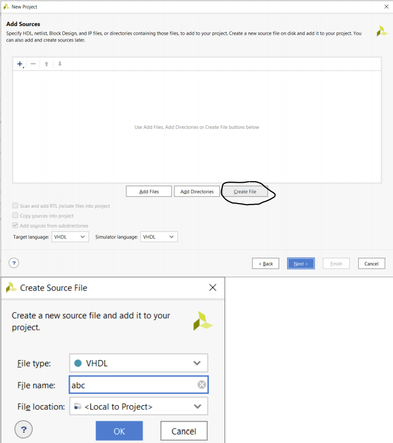

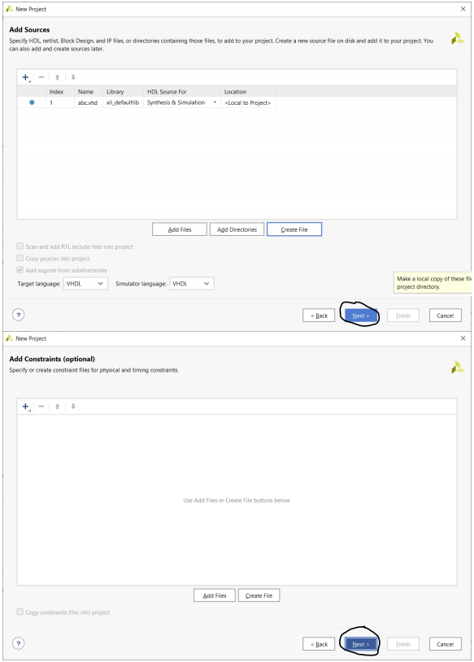

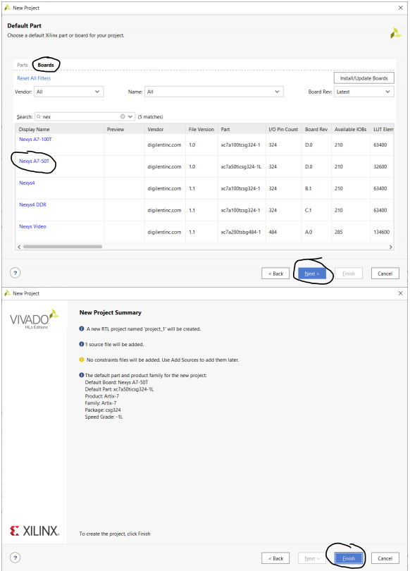

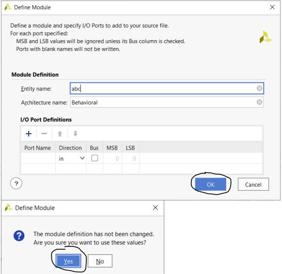

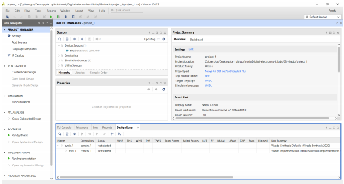

