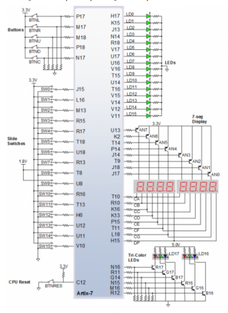

# Part 1:

## Decoder truth table for common anode 7-segment display.

| **Hex** | **Inputs** | **A** | **B** | **C** | **D** | **E** | **F** | **G** |
| :-: | :-: | :-: | :-: | :-: | :-: | :-: | :-: | :-: |
| 0 | 0000 | 0 | 0 | 0 | 0 | 0 | 0 | 1 |
| 1 | 0001 | 1 | 0 | 0 | 1 | 1 | 1 | 1 |
| 2 | 0010 | 0 | 0 | 1 | 0 | 0 | 1 | 0 |
| 3 | 0011 | 0 | 0 | 0 | 0 | 1 | 1 | 0 |
| 4 | 0100 | 1 | 0 | 0 | 1 | 1 | 0 | 0 | 
| 5 | 0101 | 0 | 1 | 0 | 0 | 1 | 0 | 0 |
| 6 | 0110 | 0 | 1 | 0 | 0 | 0 | 0 | 0 |
| 7 | 0111 | 0 | 0 | 0 | 1 | 1 | 1 | 1 |
| 8 | 1000 | 0 | 0 | 0 | 0 | 0 | 0 | 0 |
| 9 | 1001 | 0 | 0 | 0 | 0 | 1 | 0 | 0 |
| A | 1010 | 0 | 0 | 0 | 1 | 0 | 0 | 0 |
| b | 1011 | 1 | 1 | 0 | 0 | 0 | 0 | 0 |
| C | 1100 | 0 | 1 | 1 | 0 | 0 | 0 | 1 |
| d | 1101 | 1 | 0 | 0 | 0 | 0 | 1 | 0 |
| E | 1110 | 0 | 1 | 1 | 0 | 0 | 0 | 0 |
| F | 1111 | 0 | 1 | 1 | 1 | 0 | 0 | 0 |

## Schema


# Part 2:
## Architecture
```vhdl
architecture Behavioral of hex_7seg is

begin

 --------------------------------------------------------------------
    -- p_7seg_decoder:
    -- A combinational process for 7-segment display (Common Anode)
    -- decoder. Any time "hex_i" is changed, the process is "executed".
    -- Output pin seg_o(6) controls segment A, seg_o(5) segment B, etc.
    --       segment A
    --        | segment B
    --        |  | segment C
    --        |  |  |   ...   segment G
    --        +-+|+-+          |
    --          |||            |
    -- seg_o = "0000001"-------+
    --------------------------------------------------------------------
    p_7seg_decoder : process(hex_i)
    begin
        case hex_i is
            when "0000" =>
                seg_o <= "0000001";     -- 0
                
            when "0001" =>
                seg_o <= "1001111";     -- 1
                
            when "0010" =>
                seg_o <= "0010010";     -- 2
                
            when "0011" =>
                seg_o <= "0000110";     -- 3
                
            when "0100" =>
                seg_o <= "1001100";     -- 4
                
            when "0101" =>
                seg_o <= "0100100";     -- 5
                
            when "0110" =>
                seg_o <= "0100000";     -- 6
                
            when "0111" =>
                seg_o <= "0001111";     -- 7
                
            when "1000" =>
                seg_o <= "0000000";     -- 8
                
            when "1001" =>
                seg_o <= "0000100";     -- 9
                
            when "1010" =>
                seg_o <= "0001000";     -- A
                
            when "1011" =>
                seg_o <= "1100000";     -- B
                
            when "1100" =>
                seg_o <= "1001110";     -- C
                
            when "1101" =>
                seg_o <= "1000010";     -- D
                
            when "1110" =>
                seg_o <= "0110000";     -- E
                
            when others =>
                seg_o <= "0111000";     -- F
                
        end case;
    end process p_7seg_decoder;
end architecture Behavioral;
```

## Stimulation proces
```vhdl
p_stimulus : process
    begin
        -- Report a note at the begining of stimulus process
        report "Stimulus process started" severity note;
        
        s_hex <= "0000"; wait for 10 ns;

        s_hex <= "0001"; wait for 10 ns;
        
        s_hex <= "0010"; wait for 10 ns;
        
        s_hex <= "0011"; wait for 10 ns;
        
        s_hex <= "0100"; wait for 10 ns;
        
        s_hex <= "0101"; wait for 10 ns;
        
        s_hex <= "0110"; wait for 10 ns;
        
        s_hex <= "0111"; wait for 10 ns;
        
        s_hex <= "1000"; wait for 10 ns;
        
        s_hex <= "1001"; wait for 10 ns;
        
        s_hex <= "1010"; wait for 10 ns;
        
        s_hex <= "1011"; wait for 10 ns;
        
        s_hex <= "1100"; wait for 10 ns;
        
        s_hex <= "1101"; wait for 10 ns;
        
        s_hex <= "1110"; wait for 10 ns;
        
        s_hex <= "1111"; wait for 10 ns;
        
        -- Report a note at the end of stimulus process
        report "Stimulus process finished" severity note;
        wait;
    end process p_stimulus;
```
## Simulation run

