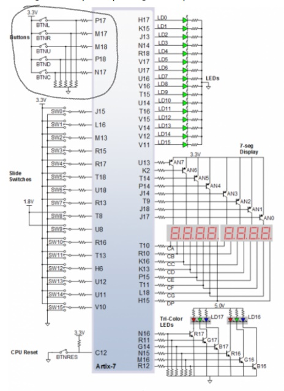
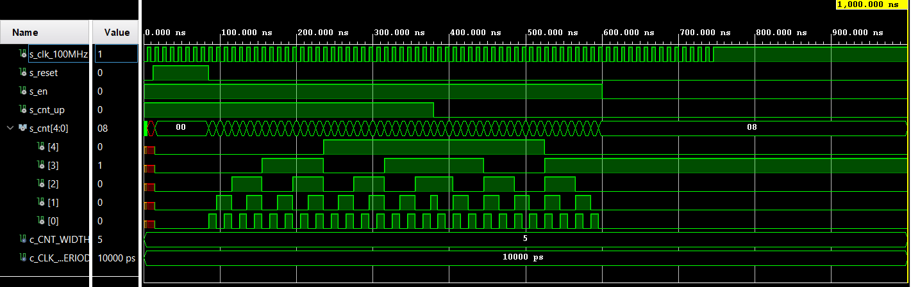

# 

| **Time interval** | **Number of clk periods** | **Number of clk periods in hex** | **Number of clk periods in binary** |
| :-: | :-: | :-: | :-: |
| 2ms | 200 000 | x"3_0d40" | b"0011_0000_1101_0100_0000" |
| 4ms | 400 000 | x"6_1A80" | b"0110_0001_1010_1000_0000" |
| 10ms | 1 000 000 | x"F_4240" | b"1111_0100_0010_0100_0000" |
| 250ms | 25 000 000 | x"17D_7840" | b"0001_0111_1101_0111_1000_0100_0000" |
| 500ms | 50 000 000 | x"2FA_F080" | b"0010_1111_1010_1111_0000_1000_0000" |
| 1sec | 100 000 000 | x"5F5_E100" | b"0101_1111_0101_1110_0001_0000_0000" |



## Archirecture

```vhdl
architecture behavioral of cnt_up_down is

    -- Local counter
    signal s_cnt_local : unsigned(g_CNT_WIDTH - 1 downto 0);

begin

    p_cnt_up_down : process(clk)
    begin
        if rising_edge(clk) then
       
            if (reset = '1') then               
                s_cnt_local <= (others => '0'); 

            elsif (en_i = '1') then  
                 
                if (cnt_up_i = '1') then
                    s_cnt_local <= s_cnt_local + 1;
                    
                else
                    s_cnt_local <= s_cnt_local - 1;
                    
                end if;
            end if;
        end if;
    end process p_cnt_up_down;

    cnt_o <= std_logic_vector(s_cnt_local);

end architecture behavioral;
```



