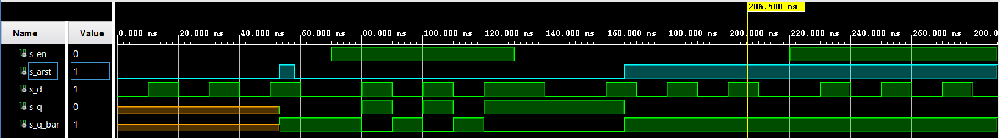
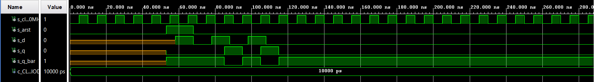
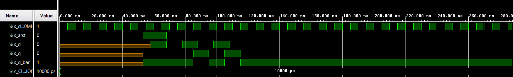

## Characteristic equations and completed tables for D, JK, T flip-flops.
   
   **q** (D) n+1 = d
   
   **q** (JK) n+1 = j * |q(2) + |k * q(n)
   
   **q** (T) n+1 = t * |q(n) + |t * q(n)

| **D** | **Qn** | **Q(n+1)** | **Comments** |
   | :-: | :-: | :-: | :-- |
   | 0 | 0 | 0 | No change |
   | 0 | 1 | 0 | Change |
   | 1 | 0 | 1 | Change |
   | 1 | 1 | 1 | No change |


   | **J** | **K** | **Qn** | **Q(n+1)** | **Comments** |
   | :-: | :-: | :-: | :-: | :-- |
   | 0 | 0 | 0 | 0 | No change |
   | 0 | 0 | 1 | 1 | No change |
   | 0 | 1 | 0 | 0 | Reset |
   | 0 | 1 | 1 | 0 | Reset |
   | 1 | 0 | 0 | 1 | Set |
   | 1 | 0 | 1 | 1 | Set |
   | 1 | 1 | 0 | 1 | Invert |
   | 1 | 1 | 1 | 0 | Invert |

   | **T** | **Qn** | **Q(n+1)** | **Comments** |
   | :-: | :-: | :-: | :-- |
   | 0 | 0 | 0 | No change |
   | 0 | 1 | 1 | No change |
   | 1 | 0 | 1 | invert |
   | 1 | 1 | 0 | invert |


## D latch
### P_D_Latch
``` vhdl
p_d_latch : process(d, arst, en)
    begin
        if (arst = '1') then
            q       <= '0';
            q_bar   <= '1';
            
        elsif (en = '1') then
            q       <= d;
            q_bar   <= not d;
            
        end if;
    end process p_d_latch;
```

### P_reset and Stimulus process

``` vhdl
    p_reset_gen : process
        begin
            s_arst <= '0';
            wait for 53 ns;
            
            s_arst <= '1';   
            wait for 5 ns;
            
            s_arst <= '0';        
               
            wait for 108 ns;           
            s_arst <= '1';
            
            wait;
     end process p_reset_gen;
    
    p_stimulus: process
    begin
        -- Report a note at the begining of stimulus process
        report "Stimulus process started" severity note;
        s_en <= '0';
        s_d  <= '0';

        --d sequence
        wait for 10 ns;
        s_d <= '1';
        wait for 10 ns;
        s_d <= '0';
        wait for 10 ns;
        s_d <= '1';
        wait for 10 ns;
        s_d <= '0';
        wait for 10 ns;
        s_d <= '1';
        wait for 10 ns;
        s_d <= '0';
        wait for 10 ns;
        --/d sequence

        s_en <= '1';
        
        wait for 3 ns;
        assert(s_q = '0' and s_q_bar = '1')
        report "chyba" severity error;
        
        --d sequence
        wait for 7 ns;
        s_d <= '1';
        wait for 10 ns;
        s_d <= '0';
        wait for 10 ns;
        s_d <= '1';
        wait for 10 ns;
        s_d <= '0';
        wait for 10 ns;
        s_d <= '1';
        wait for 10 ns;
        s_en <= '0'; 
        wait for 10 ns;
        s_d <= '0';
        wait for 10 ns;
        --/d sequence
        
        wait for 3 ns;
        assert(s_q = '1' and s_q_bar = '0')
        report "chyba" severity error;
        
        --d sequence
        wait for 10 ns;
        s_d <= '1';
        wait for 10 ns;
        s_d <= '0';
        wait for 10 ns;
        s_d <= '1';
        wait for 10 ns;
        s_d <= '0';
        wait for 10 ns;
        s_d <= '1';
        wait for 10 ns;
        s_d <= '0';
        wait for 10 ns;
        --/d sequence
        
        s_en <= '1';
        wait for 3 ns;
        assert(s_q = '1' and s_q_bar = '1')
        report "chyba" severity error;
                
        --d sequence
        wait for 10 ns;
        s_d <= '1';
        wait for 10 ns;
        s_d <= '0';
        wait for 10 ns;
        s_d <= '1';
        wait for 10 ns;
        s_d <= '0';
        wait for 10 ns;
        s_d <= '1';
        wait for 10 ns;
        s_d <= '0';
        wait for 10 ns;
        --/d sequence
        
        report "Stimulus process finished. " severity note;       
        wait;
     end process p_stimulus;

end Behavioral;
```


## processes p_d_ff_arst
``` vhdl
architecture Behavioral of d_ff_arst is

begin
    p_d_ff_arst : process (clk, arst)
        begin
            if (arst = '1') then
                q       <= '0';
                q_bar   <= '1';
            
            elsif rising_edge(clk) then
                q       <= d;
                q_bar   <= not d;
            
            end if;
    end process p_d_ff_arst;

end Behavioral;
```


## testbench p_d_ff_arst
``` vhdl
library IEEE;
use IEEE.STD_LOGIC_1164.ALL;

entity tb_d_ff_arst is
--  Port ( );
end tb_d_ff_arst;

architecture Behavioral of tb_d_ff_arst is

    -- Local constants
    constant c_CLK_100MHz_PERIOD : time    := 10 ns;

    signal s_clk_100MHz     : std_logic;
    signal s_arst   : std_logic;
    signal s_d      : std_logic;
    signal s_q      : std_logic;
    signal s_q_bar  : std_logic;
begin
    uut_d_ff_arst : entity work.d_ff_arst
        port map (
            clk    => s_clk_100MHz,
            arst  => s_arst,
            d     => s_d,
            q     => s_q,
            q_bar => s_q_bar
        );

    --------------------------------------------------------------------
    -- Clock generation process
    --------------------------------------------------------------------
    p_clk_gen : process
    begin
        while now < 750 ns loop         -- 75 periods of 100MHz clock
            s_clk_100MHz <= '0';
            wait for c_CLK_100MHZ_PERIOD / 2;
            s_clk_100MHz <= '1'; 
            wait for c_CLK_100MHZ_PERIOD / 2;
        end loop;
        wait;
    end process p_clk_gen;
    
        --------------------------------------------------------------------
    -- Reset generation process
    --------------------------------------------------------------------
    p_reset_gen : process
        begin
            s_arst <= '0';
            wait for 53 ns;
            
            s_arst <= '1';   
            wait for 15 ns;
            
            s_arst <= '0';
            wait;
        end process p_reset_gen;
        
        p_stimulus: process
    begin
        -- Report a note at the begining of stimulus process
        report "Stimulus process started" severity note;
        
        --d sequence
        wait for 58 ns;
        s_d <= '1';
        assert(s_q = '0' and s_q_bar = '1') 
        report "Chyba" severity error;
        
        wait for 10 ns;
        s_d <= '0';
        assert(s_q = '0' and s_q_bar = '1') 
        report "Chyba" severity error;
        
        wait for 10 ns;
        s_d <= '1';
        
        wait for 10 ns;
        s_d <= '0';
        
        wait for 10 ns;
        s_d <= '1';
        assert(s_q = '0' and s_q_bar = '1') 
        report "Chyba" severity error;
        
        wait for 10 ns;
        s_d <= '0';
        
        wait for 10 ns;
        --/d sequence

        report "Stimulus process finished. " severity note;       
        wait;
     end process p_stimulus;
        
        
end Behavioral;
```

## processes p_jk_ff_rst
``` vhdl
p_jk_ff_rst : process (clk)
        begin
            if rising_edge(clk) then
                if (rst = '1') then
                    s_q <= '0';
                    else
                        if (j = '0' and k = '0') then
                            s_q <= s_q;
                        elsif (j = '0' and k = '1') then
                            s_q <= '0';
                        elsif (j = '1' and k = '0') then
                            s_q <= '1';
                        elsif  (j = '1' and k = '1') then
                            s_q <= not s_q;
                        end if;
                    end if;
                end if;
    end process p_jk_ff_rst;
```

## tb_jk_ff_rst
``` vhdl
    --------------------------------------------------------------------
    -- Clock generation process
    --------------------------------------------------------------------
    p_clk_gen : process
    begin
        while now < 750 ns loop         -- 75 periods of 100MHz clock
            s_clk_100MHz <= '0';
            wait for c_CLK_100MHZ_PERIOD / 2;
            s_clk_100MHz <= '1'; 
            wait for c_CLK_100MHZ_PERIOD / 2;
        end loop;
        wait;
    end process p_clk_gen;
    
    --------------------------------------------------------------------
    -- Reset generation process
    --------------------------------------------------------------------
    p_reset_gen : process
        begin
            s_rst <= '0';
            wait for 53 ns;
            
            s_rst <= '1';   
            wait for 15 ns;
            
            s_rst <= '0';
            wait;
        end process p_reset_gen;
        
        p_stimulus: process
    begin
        -- Report a note at the begining of stimulus process
        report "Stimulus process started" severity note;
        
        --d sequence
        wait for 13 ns;
        s_j <= '0';
        s_k <= '0';
        
        wait for 20 ns;
        s_j <= '0';
        s_k <= '1';
        
        wait for 20 ns;
        s_j <= '1';
        s_k <= '0';
        
        wait for 20 ns;
        s_j <= '1';
        s_k <= '1';
        
        wait for 20 ns;
        s_j <= '1';
        s_k <= '1';
        
        wait for 20 ns;
        --/d sequence

        report "Stimulus process finished. " severity note;       
        wait;
     end process p_stimulus;
        
end Behavioral;
```

